# Architecture Diagrams - Code Quality Assessment

Date: 2025-07-26T06:43:02+02:00

## Current State Architecture

### Dual Application Problem

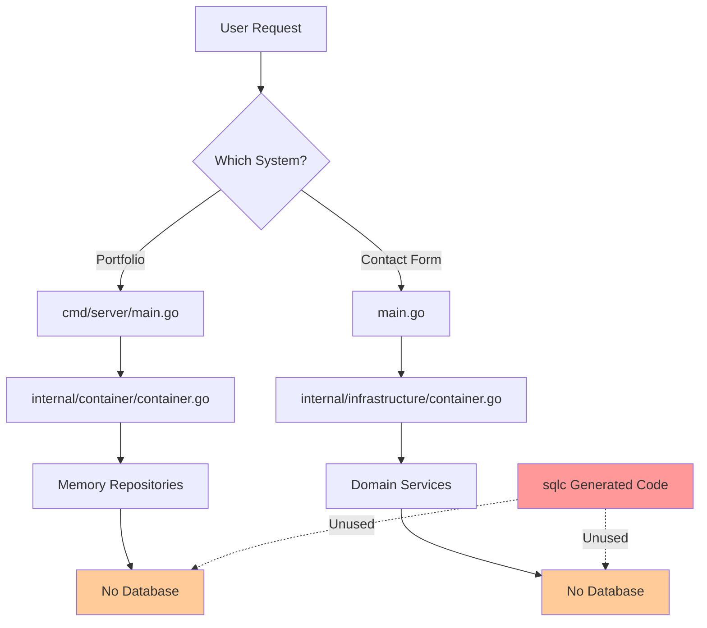

### Current Dependency Graph

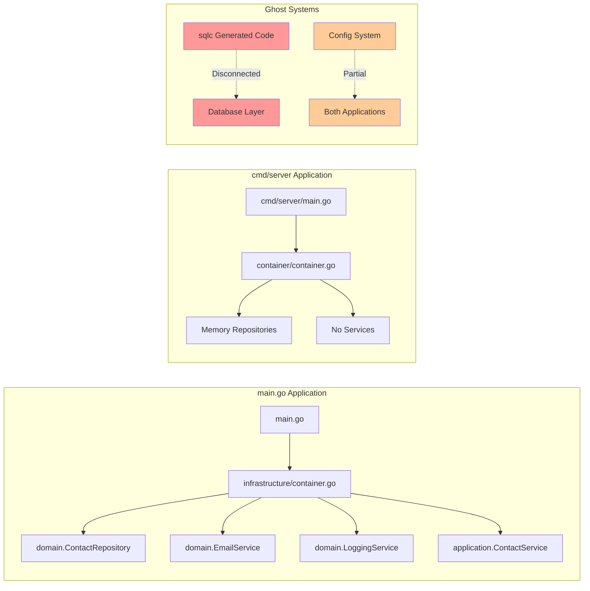

## Missing Library Dependencies

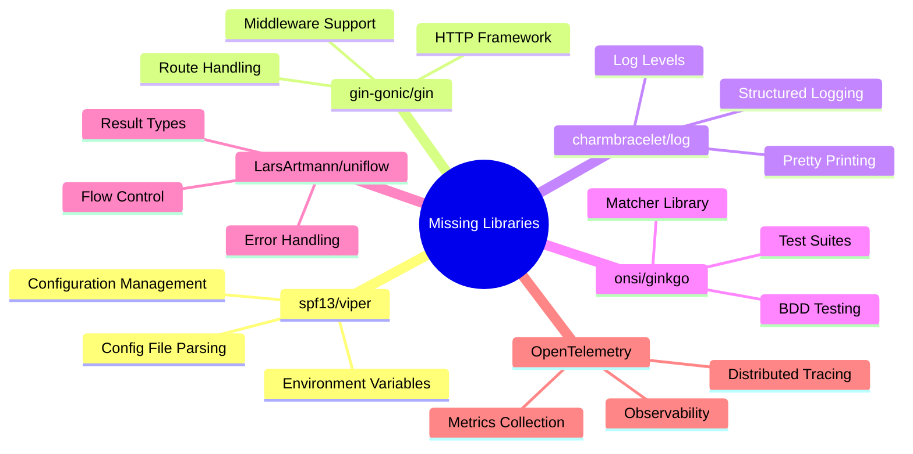

## Code Quality Issues Categorization

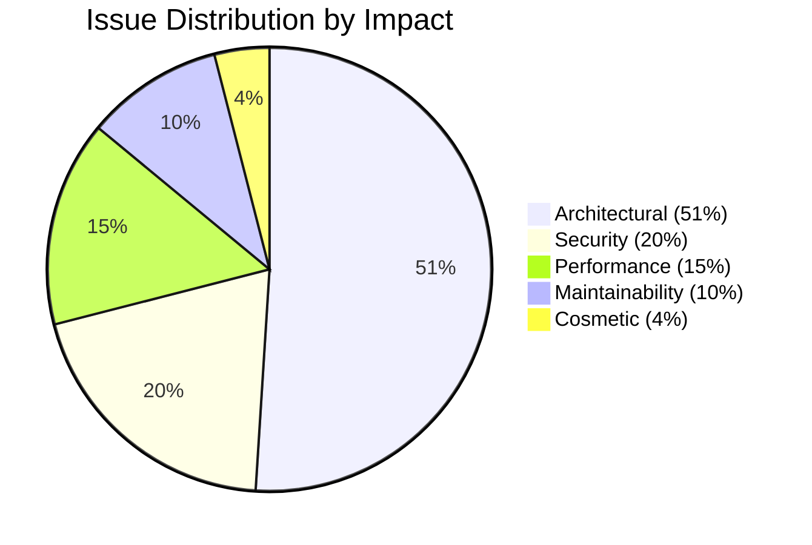

## Quality Assessment Flow

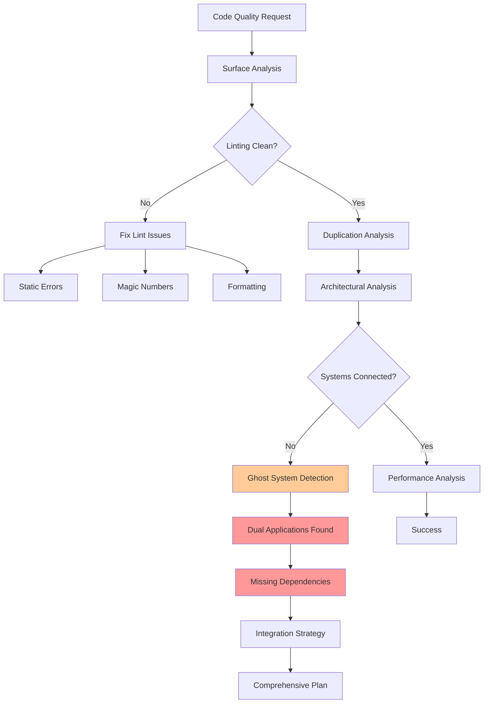

## Proposed Target Architecture

### Unified Application Architecture

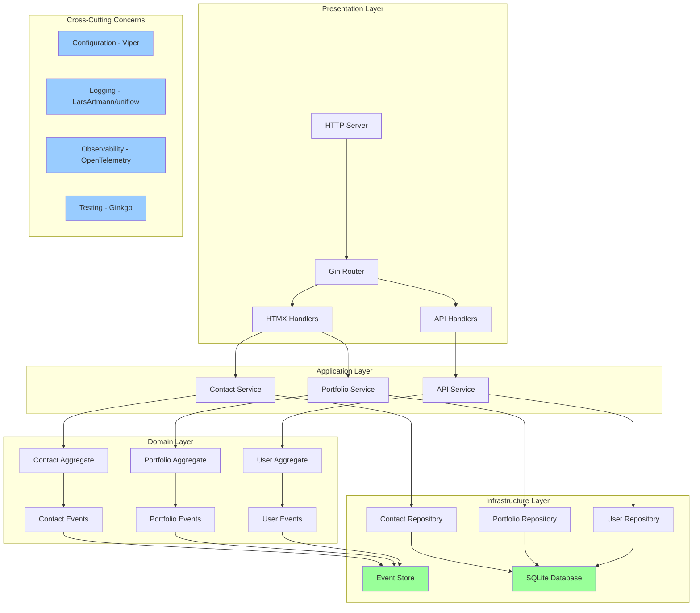

### Event Sourcing Architecture

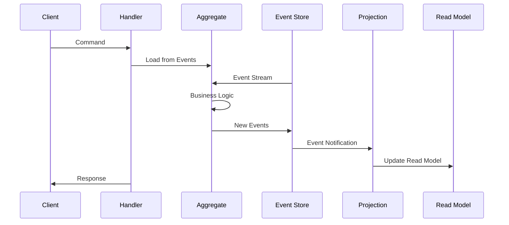

### CQRS Implementation

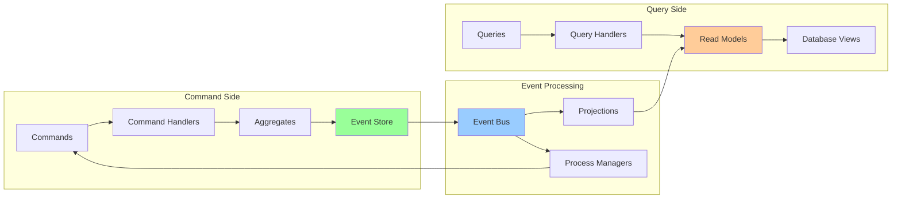

## Migration Strategy

### Phase 1: Foundation

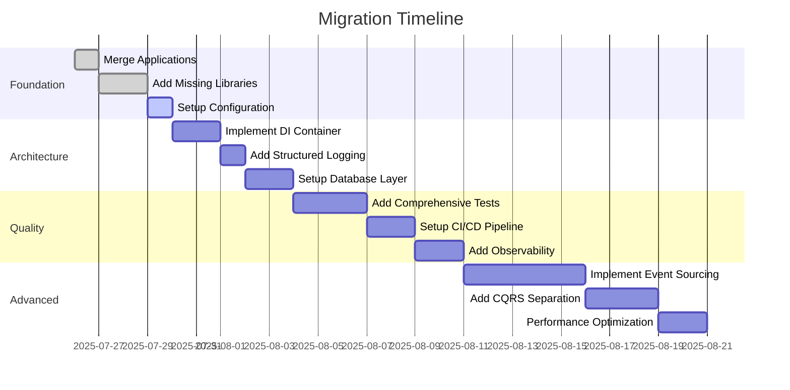

### Dependency Resolution Order

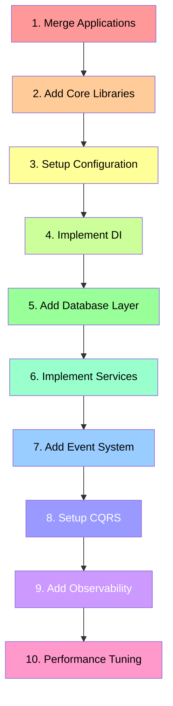

## System Integration Points

### External Services Integration

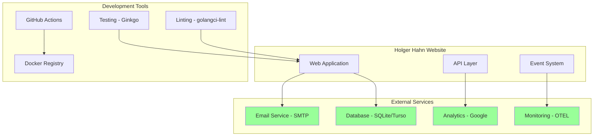

## Testing Architecture

### Test Pyramid

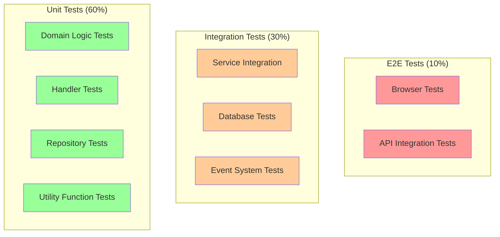

## Deployment Architecture

### Production Topology

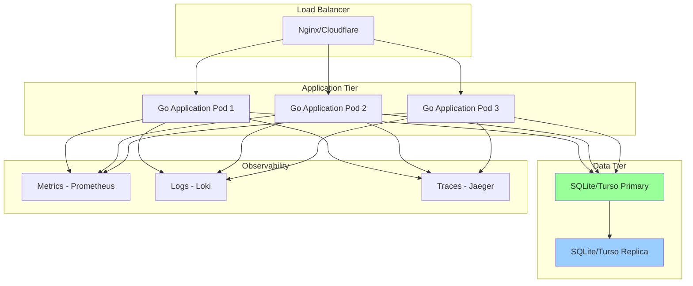

---
Generated during comprehensive code quality improvement project
Claude (Sonnet 4) - 2025-07-26